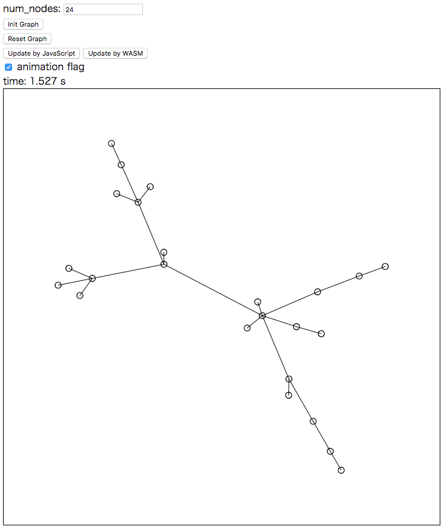

# graph_wasm

力学モデルを使った木構造グラフの描画を、JavaScriptとWebAssemblyで実行する。

## 依存関係

* rust >= 1.17.0
* emsdk
* just
* npm
* WebAssemblyが動作するブラウザ
* jQuery-3.2.1（dist/js/jquery-3.2.1.min.jsに配置）
* jCanvas（dist/js/jcanvas.min.jsに配置）

## ビルド方法

```sh
$ just
$ npm install
$ npm run build
```

## 実行方法

```sh
$ cd dist
$ python -m SimpleHTTPServer
```

## スクリーンショット



## 使い方

1. num_nodesに木構造グラフをのノード数を入力する
2. [Init Graph]を押下してグラフのノード位置を初期化する
3. [Update by JavaScript]または[Update by WASM]を押下して、力学モデルを使ってノード位置を更新する
4. 実行にかかった時間がtimeに表示される

※ animation flagをOFFにした場合は、ノード位置が収束するまで描画しない。

## 参考

* 実装の参考にさせていただきました: http://leko.jp/archives/699

